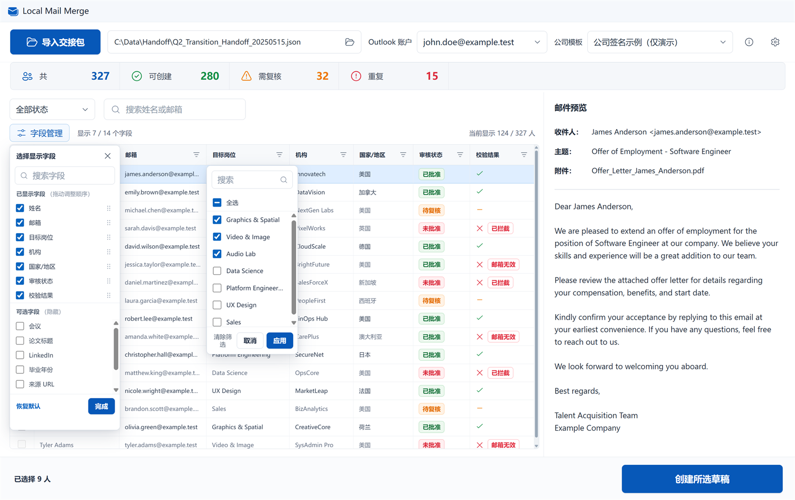

<h1 align="center">Local Mail Merge</h1>

<p align="center">
  <strong>把审核好的收件人数据，安全地整理成 Outlook 草稿。</strong>
</p>

<p align="center">
  从 Excel、CSV 或 JSON 导入，逐封预览、筛选和确认。<br />
  应用只保存草稿，不会自动发送邮件。
</p>

<p align="center">
  <a href="https://github.com/SeanX16/local-mail-merge/releases/latest"><strong>下载最新版</strong></a>
  ·
  <a href="#-快速开始">快速开始</a>
  ·
  <a href="docs/guides/AI数据准备与交接规范.md">AI 数据准备规范</a>
</p>

<p align="center">
  
  
  
  
</p>



| 导入前已经审核 | 创建前逐封确认 | 发送始终由你决定 |
|---|---|---|
| 支持 Excel、CSV 和标准 JSON 交接包 | 表格筛选、行选择、正文与签名预览 | 批量操作只调用 Outlook 的“保存草稿” |

> [!IMPORTANT]
> Local Mail Merge 不会自动发送邮件。草稿创建后，请在经典 Outlook 中再次检查收件人、主题、正文和签名，再手动发送。

## 📥 下载

当前正式版为 **v1.0.0**，仅支持 Windows x64。

| 版本 | 适合场景 | 下载 |
|---|---|---|
| 安装版 | 标准安装向导，可选择安装目录和快捷方式 | [下载 Setup.exe](https://github.com/SeanX16/local-mail-merge/releases/download/v1.0.0/Local-Mail-Merge-v1.0.0-Setup.exe) |
| 便携版 | 不想安装，或先在工作电脑上测试 | [下载 Portable ZIP](https://github.com/SeanX16/local-mail-merge/releases/download/v1.0.0/Local-Mail-Merge-v1.0.0-Portable-win-x64.zip) |

便携版不是单文件程序。下载后请完整解压到一个新文件夹，再运行 `LocalMailMerge.exe`，不要直接在压缩包里启动。

安装版可以选择为当前用户或所有用户安装，也可以自定义安装目录，并决定是否创建开始菜单和桌面快捷方式。

发布页还提供 SHA-256 校验文件，用来确认下载是否完整。它们不参与安装，普通使用可以不下载。

> [!NOTE]
> 应用目前没有代码签名证书，Windows 可能显示 SmartScreen 提示。请只从本仓库的 [Releases 页面](https://github.com/SeanX16/local-mail-merge/releases/latest) 下载。

## 🧪 下载测试文件

想先走一遍完整流程，可以下载这两个虚构示例。它们不包含真实姓名、邮箱或公司数据。

| 文件 | 用途 | 下载 |
|---|---|---|
| 虚构 JSON 交接包 | 测试数据导入、筛选、预览和校验提示 | [下载 `outreach_package.sample.json`](https://github.com/SeanX16/local-mail-merge/raw/refs/heads/main/samples/outreach_package.sample.json) |
| HTML 签名示例 | 测试签名导入、重命名和草稿预览 | [下载 `company_signature.sample.html`](https://github.com/SeanX16/local-mail-merge/raw/refs/heads/main/templates/company_signature.sample.html) |

下载后先导入 JSON 交接包，再到“设置 → 邮件签名”导入 HTML 文件。示例签名没有额外图片依赖，可以单独使用。

## ✅ 使用前准备

- Windows 10 或 Windows 11（64 位）；
- 已安装并登录经典桌面版 Outlook；
- Outlook 至少正常启动过一次；
- 一份 `.xlsx`、`.csv` 或 `.json` 格式的邮件数据。

目前不支持“新版 Outlook”。如果电脑同时装了两个版本，请确认经典 Outlook 能正常打开账户和草稿箱。

## 🚀 快速开始

1. 打开 Local Mail Merge，点击“导入交接包”。
2. 选择准备好的 Excel、CSV 或 JSON 文件。
3. 如果导入的是 Excel，确认工作表和表头所在行。应用会先给出推荐，你也可以自己改。
4. 在顶部选择正确的 Outlook 发件账户和邮件签名。
5. 使用表格筛选、逐行勾选，并在右侧预览收件人、主题、正文和签名。
6. 处理红色拦截项；黄色警告项需要你主动勾选并在确认框里再次确认。
7. 点击“创建所选草稿”。
8. 打开 Outlook 草稿箱，逐封检查收件人、主题、正文和签名，再手动发送。

```text
导入数据  →  筛选与预览  →  处理校验提示  →  创建草稿  →  Outlook 人工发送
```

应用批量处理时只保存草稿，不会自动发送，也不会为每封邮件打开一个撰写窗口。

## 📄 准备邮件数据

最少需要一列能识别为收件邮箱。正式使用时，建议准备以下字段：

| 字段 | 用途 |
|---|---|
| `person_id` | 每个人稳定且不重复的编号 |
| `recipient_name` | 收件人姓名 |
| `recipient_email` | 收件邮箱 |
| `subject` | 邮件主题 |
| `body_text` 或 `body_html` | 邮件正文 |
| `target_role` | 对应岗位 |
| `review_status` | 人工审核状态 |

其他列不会被丢掉，可以继续用于筛选和预览。主题或正文为空时文件仍能导入，但默认会被拦截，直到你补齐内容
或在设置中修改本地规则。

如果你让 AI 帮忙整理数据，请把
[AI 数据准备与交接规范](docs/guides/AI数据准备与交接规范.md)
直接交给它。里面写明了 Excel、JSON、签名图片、字段命名、内容哈希和交付前检查要求。

## ✍️ 邮件签名

在“设置 → 邮件签名”中可以导入 `.html`、`.htm` 或 `.oft` 文件。

- HTML 签名如果引用 Logo 等本地图片，请把 HTML 和图片文件夹放在一起再导入；
- 应用会把可读取的本地图片打包进签名副本，原始文件不会被修改；
- `.oft` 适合保留 Outlook 的内嵌图片，但检查和使用它需要经典 Outlook；
- 导入后可以修改签名在应用里的显示名称，不会改动原始文件名；
- 最稳妥的检查方式是在设置页创建一封“无收件人测试草稿”，然后到 Outlook 查看实际排版。

应用内预览不会加载远程图片、电脑上的绝对路径图片或 CSS 背景资源，因此 Outlook 测试草稿才是最终效果依据。

## 🛡️ 校验与重复保护

应用会固定拦截无效邮箱和同一批次内重复的人员编号。其余规则可以在“设置 → 导入与安全”里调整为拦截、警告
或默认放行。

| 默认结果 | 情况 |
|---|---|
| 拦截 | 已经成功创建过的相同草稿、空主题和空正文 |
| 警告 | 未替换的占位符、同一批次内重复邮箱 |
| 可配置 | 审核状态、个性化事实和内容哈希等业务规则 |

重复保护使用批次、人员编号和实际邮件内容共同判断。不要通过改文件名或人员编号来绕过去重；如果确实需要重新
创建，请先确认原因，再调整相应规则。

## 📁 数据保存位置

| 内容 | 本机目录 |
|---|---|
| 应用设置和已导入签名 | `%APPDATA%\Local Mail Merge\` |
| 草稿去重记录和本地结果报告 | `%LOCALAPPDATA%\SeanX16\LocalMailMerge\` |

早期测试版留下的 `%LOCALAPPDATA%\HKRC\LocalMailMerge\` 数据仍能继续读取。应用不会把 Outlook
登录凭据写入这些目录，也不会把邮件数据上传到外部服务。

卸载安装版可以使用 Windows 的“已安装的应用”。便携版可以直接删除解压目录。若还要删除个人设置和去重记录，
请先确认这些记录以后不再需要，再按公司 IT 规则清理上面的 AppData 目录。

## ❓ 常见问题

<details>
<summary><strong>找不到 Outlook 账户</strong></summary>

确认经典 Outlook 已安装、当前用户已登录，并先手动打开一次 Outlook。如果仍然找不到，可在设置页重新检测账户。

</details>

<details>
<summary><strong>签名在应用里和 Outlook 里不完全一样</strong></summary>

应用预览会主动限制外部资源。请创建无收件人测试草稿，以 Outlook 中的实际效果为准。

</details>

<details>
<summary><strong>为什么某一行不能勾选</strong></summary>

先查看右侧的校验提示。无效邮箱和重复人员编号必须修正；其他问题可以根据实际情况修改数据或调整本地规则。

</details>

<details>
<summary><strong>便携版更新时可以覆盖旧文件夹吗</strong></summary>

建议把新版本解压到一个新的文件夹，确认能正常运行后再删除旧目录。个人设置保存在 AppData，不会因为换目录而丢失。

</details>

更完整的工作电脑检查步骤见
[公司电脑快速测试](docs/testing/公司电脑快速测试.md)。

## 🧑‍💻 开发

需要 Node.js、.NET SDK 和 Windows。进入 `src\LocalMailMerge.Desktop` 后运行：

```powershell
npm install
npm run desktop
```

生成安装器和便携 ZIP：

```powershell
npm run make
```

构建结果位于 `src\LocalMailMerge.Desktop\out\make\`。

## 📜 作者与许可证

由 [Sean](https://github.com/SeanX16) 开发与维护。

Copyright © 2026 Sean.

Licensed under the [MIT License](LICENSE).
